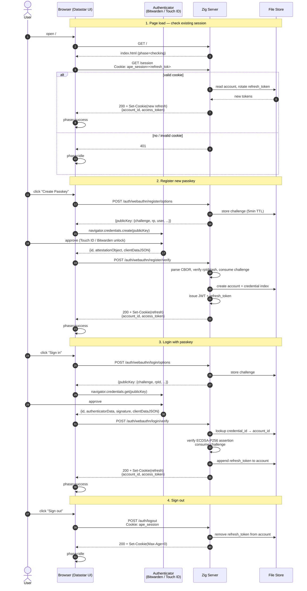

# Ape Auth — Data Flow

```mermaid
sequenceDiagram
    autonumber
    actor User
    participant Browser as Browser (Datastar UI)
    participant Auth as Authenticator<br/>(Bitwarden / Touch ID)
    participant Server as Zig Server
    participant FS as File Store

    Note over Browser,FS: 1. Page load — check existing session
    User->>Browser: open /
    Browser->>Server: GET /
    Server-->>Browser: index.html (phase=checking)
    Browser->>Server: GET /session<br/>Cookie: ape_session=<refresh_tok>
    alt valid cookie
        Server->>FS: read account, rotate refresh_token
        FS-->>Server: new tokens
        Server-->>Browser: 200 + Set-Cookie(new refresh)<br/>{account_id, access_token}
        Browser->>Browser: phase=success
    else no / invalid cookie
        Server-->>Browser: 401
        Browser->>Browser: phase=idle
    end

    Note over Browser,FS: 2. Register new passkey
    User->>Browser: click "Create Passkey"
    Browser->>Server: POST /auth/webauthn/register/options
    Server->>FS: store challenge (5min TTL)
    Server-->>Browser: {publicKey: {challenge, rp, user, ...}}
    Browser->>Auth: navigator.credentials.create(publicKey)
    User->>Auth: approve (Touch ID / Bitwarden unlock)
    Auth-->>Browser: {id, attestationObject, clientDataJSON}
    Browser->>Server: POST /auth/webauthn/register/verify
    Server->>Server: parse CBOR, verify rpIdHash, consume challenge
    Server->>FS: create account + credential index
    Server->>Server: issue JWT + refresh_token
    Server-->>Browser: 200 + Set-Cookie(refresh)<br/>{account_id, access_token}
    Browser->>Browser: phase=success

    Note over Browser,FS: 3. Login with passkey
    User->>Browser: click "Sign in"
    Browser->>Server: POST /auth/webauthn/login/options
    Server->>FS: store challenge
    Server-->>Browser: {publicKey: {challenge, rpId, ...}}
    Browser->>Auth: navigator.credentials.get(publicKey)
    User->>Auth: approve
    Auth-->>Browser: {id, authenticatorData, signature, clientDataJSON}
    Browser->>Server: POST /auth/webauthn/login/verify
    Server->>FS: lookup credential_id → account_id
    Server->>Server: verify ECDSA-P256 assertion<br/>consume challenge
    Server->>FS: append refresh_token to account
    Server-->>Browser: 200 + Set-Cookie(refresh)<br/>{account_id, access_token}
    Browser->>Browser: phase=success

    Note over Browser,FS: 4. Sign out
    User->>Browser: click "Sign out"
    Browser->>Server: POST /auth/logout<br/>Cookie: ape_session
    Server->>FS: remove refresh_token from account
    Server-->>Browser: 200 + Set-Cookie(Max-Age=0)
    Browser->>Browser: phase=idle
```
